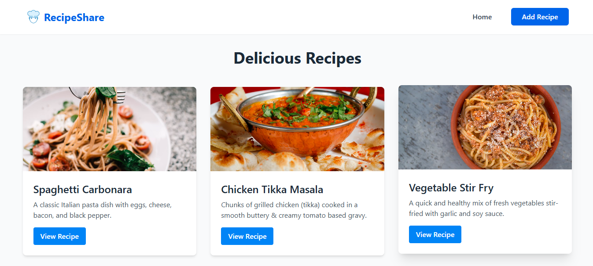
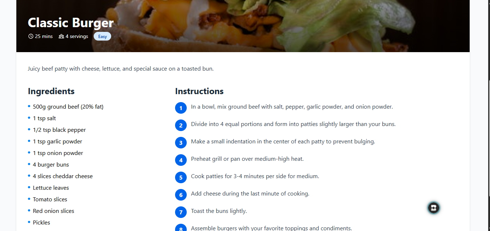

# RecipeShare 🍳



*Screenshot of the RecipeShare homepage*

A modern, responsive web application built with React and Tailwind CSS for sharing and discovering delicious recipes. This project is part of the ALX Front-End Development curriculum, focusing on building responsive UIs with React and utility-first CSS.

## 🆕 Latest Updates

- Added detailed Recipe View page for each recipe

  
  *Screenshot of the Recipe Details page*

- Enhanced recipe data with complete ingredients and step-by-step instructions
- Improved error handling and loading states
- Responsive design for all screen sizes

## 📂 Project Structure

```
recipe-sharing-platform/
├── public/                   # Static files
│   ├── chef-icon.png         # Application favicon
│   ├── Recipe-Details-Page.png # Recipe details screenshot
│   ├── RecipeShare-HomePage.png # Homepage screenshot
│   └── vite.svg              # Vite default logo
├── src/                      # Source files
│   ├── assets/               # Static assets (images, icons, etc.)
│   │   └── chef-icon.png     # Chef hat icon
│   ├── components/           # Reusable React components
│   │   ├── HomePage.jsx      # Home page component
│   │   ├── RecipeDetail.jsx  # Recipe detail component
│   │   └── AddRecipeForm.jsx # Form to add new recipes
│   ├── App.css               # Global styles
│   ├── App.jsx               # Main application component
│   ├── data.json             # Recipe data
│   ├── index.css             # Global styles
│   ├── main.jsx              # Application entry point
│   └── output.css            # Compiled Tailwind CSS
├── .gitignore               # Git ignore file
├── index.html               # Main HTML file
├── package.json             # Project dependencies and scripts
├── package-lock.json        # Dependency lock file
├── postcss.config.js        # PostCSS configuration
├── tailwind.config.js       # Tailwind CSS configuration
└── vite.config.js           # Vite configuration
```

## 🚀 Features

- **Responsive Design**: Fully responsive layout that works on all device sizes
- **Recipe Browsing**: View a collection of recipes with beautiful cards
- **Recipe Details**: Comprehensive view for each recipe including:
  - Complete ingredients list with measurements
  - Step-by-step cooking instructions
  - Preparation and cooking times
  - Number of servings
  - Difficulty level
- **Modern UI**: Clean and intuitive interface built with Tailwind CSS
- **Interactive Elements**: 
  - Smooth transitions between pages
  - Loading states for better UX
  - Error handling for missing data
  - Responsive image display

## 🛠️ Technologies Used

- React 18
- Vite
- Tailwind CSS
- React Router
- React Icons

## 📋 Prerequisites

- Node.js (v16 or higher)
- npm or yarn
- Git

## 🚀 Getting Started

1. **Clone the repository**
   ```bash
   git clone https://github.com/your-username/recipe-sharing-platform.git
   cd recipe-sharing-platform
   ```

2. **Install dependencies**
   ```bash
   npm install
   # or
   yarn install
   ```

3. **Install required packages**
   ```bash
   npm install react-router-dom
   # or
   yarn add react-router-dom
   ```

4. **Start the development server**
   ```bash
   npm run dev
   # or
   yarn dev
   ```

5. **Open in your browser**
   The application will be available at `http://localhost:5173`

## 🎨 Features Implemented

- **Responsive Navigation Bar**: Clean navigation with logo and menu items
- **Recipe Grid Layout**: Responsive grid that adjusts based on screen size
- **Recipe Cards**: Beautiful cards with images, titles, and descriptions
- **Loading States**: Smooth loading indicators while data is being fetched
- **Hover Effects**: Interactive elements with smooth transitions
- **Responsive Design**: Works on mobile, tablet, and desktop screens


## 📚 Learning Objectives

By completing this project, you will learn how to:

- Set up a React application with Vite and Tailwind CSS
- Create responsive layouts using Tailwind's utility classes
- Implement client-side routing with React Router
- Build reusable UI components
- Handle form submissions and state management
- Style components using a utility-first CSS approach

## 🤝 Contributing

Contributions are welcome! Please feel free to submit a Pull Request.

## 📄 License

This project is licensed under the MIT License - see the [LICENSE](LICENSE) file for details.

## 🙏 Acknowledgments

- ALX Front-End Development Program
- Vite and React teams for the amazing tooling
- Tailwind CSS for the utility-first framework
